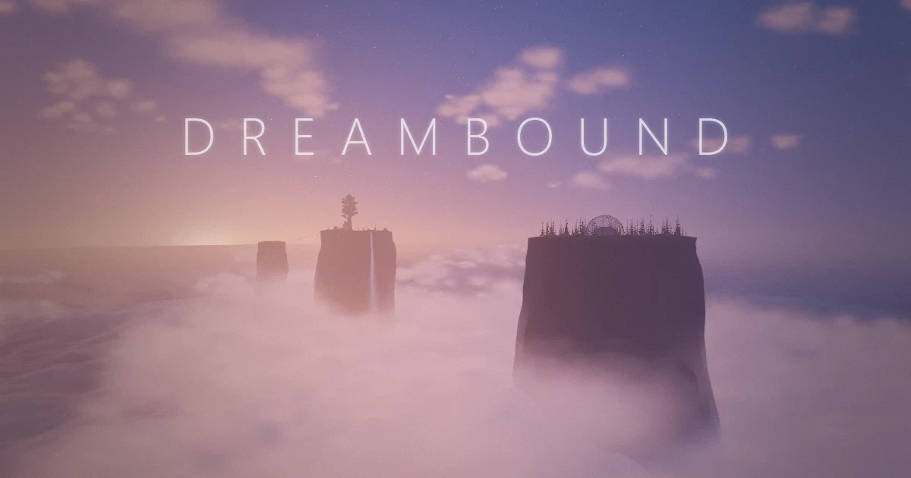

# Dreambound

A quiet world of sea stack islands above the clouds. Wander, look closely, and press on what catches your eye.



**Play it:** https://dreambound.z13.web.core.windows.net/

Dreambound is a first-person exploration and puzzle game that runs in the browser, in the spirit of Myst and Riven.
You wake in a cabin on one of five islands standing out of a sea of cloud. There is no HUD, no map and no quest log:
the world is the interface. Elevators run down through the rock to caves that join the islands, a generator decides
which of them has power, and what you notice in one place is usually the answer to something somewhere else.

- **Five islands** to explore, each with its own purpose, most of them joined by caves underneath.
- **A full day and night** every 13 minutes: sunrise, a long dusk, stars and a moon. Some things can only be seen at
  the right hour.
- **Nothing sampled, nothing bought in:** every sound is synthesised live in the browser, and every model and texture
  in the game is generated by a script in this repository.
- **You can't die.** Walk off an edge and you wake back where you stood. It is a dream.

## Controls

| | |
|---|---|
| **Mouse** | Look around |
| **W A S D** | Walk |
| **Shift** | Run |
| **Space**, **E** or **left click** | Use what the dot in the centre of the view is on (it grows over anything you can press) |
| **M** | Menu: save, graphics, colour grading, gameplay |
| **Esc** | Free the mouse (click the view to take it back) |
| **F7** | Save a screenshot |

Ladders: walk into one and press **W**. Chairs and benches: press them to sit, and again to stand.

The game does not save by itself. Use **Menu > Game > Save**; the next visit in the same browser picks up from there.

## What you need

A desktop browser with WebGL 2, a mouse and a keyboard; it has been played in Chrome and Firefox. It aims for
60 frames a second at 1080p on a mid-range graphics card; the menu's Graphics page has anti-aliasing and shadow
quality if you have less, or more, to spend.

## Running it yourself

You need [Node.js](https://nodejs.org) 20.19 or newer (or 22.12 and up).

```bash
npm install
npm run dev
```

Then open http://localhost:5173 and click to begin.

```bash
npm run build      # a production build into dist/
npm run preview    # serve that build locally
```

A few address-bar switches help while working on it:

| Add to the address | What it does |
|---|---|
| `?skip` | Skips the wake-up and starts you standing by the bed |
| `?nosave` | Ignores the saved game, and doesn't write one |
| `?spawn=rocks` | Starts on an island: `dome`, `rocks`, `tower`, `mountain` or `end` |
| `?t=0.3` | Starts at a time of day (0 is sunrise, about 0.54 is sunset) |
| `?dev` | Developer mode: frame statistics in the console and the game's objects on `window` |

They combine: `http://localhost:5173/?dev&skip&nosave`.

## How it is built

| | |
|---|---|
| Rendering | [three.js](https://threejs.org) (WebGL 2), with its own sky, clouds, lighting, level of detail and post-processing |
| Collision | [three-mesh-bvh](https://github.com/gkjohnson/three-mesh-bvh): a capsule against the world's triangles |
| Sound | The Web Audio API, fully procedural: no audio files |
| Models and textures | [Blender](https://www.blender.org) 5.2, run headless by Python scripts that build, bake and export each model |
| Tooling | [Vite](https://vite.dev) |

```
src/
  main.js        boot, the frame loop, and how the pieces are wired together
  core/          input, the day/night clock, interaction, saving
  player/        the first-person controller and its collision
  world/         terrain, the five islands, paths, water, trees and flowers
  props/         the things you find: cabin, observatory, elevators, terminal, gatehouse...
  render/        sky, clouds, lighting, storm, materials, post-processing
  sequences/     the cutscenes
  audio/         the sound engine
  ui/            the menu, title screen and credits
  dev/, net/     developer tours, and sending bug reports
public/models/   the built models and textures the game loads
tools/
  blender/       the scripts that generate public/models
  regress/       the regression harness
  audio/         offline rendering and checks for the sound engine
  deploy/        build, compress and upload
  bugqueue/      collects bug reports sent from the game
```

### Checking a change

```bash
node tools/regress/run.mjs     # builds the world without a browser and compares it with a recorded baseline (~80 s)
node tools/audio/check.mjs     # the sound engine's rules
npm run build
```

The harness fingerprints the world (terrain, placements, colliders) and walks a capsule along a few thousand routes,
so a change that moves something it shouldn't, or opens a hole to fall through, shows up. See
[tools/regress/README.md](tools/regress/README.md). The sound tools render any sound to a WAV and a spectrogram
without a browser: [tools/audio/README.md](tools/audio/README.md).

### Rebuilding a model

Each model has a design script and a runner in `tools/blender/`. With Blender 5.2 installed:

```bash
blender --background --factory-startup --python tools/blender/build_deck.py
```

It writes the model and its textures into `public/models/`. The scripts currently expect the repository at
`C:/repos/Dreambound`.

### Deploying

```bash
npm run deploy -- --preset=small
```

Builds the game, compresses the models and textures (about 130 MB down to about 22 MB with `small`), and uploads what
changed to an Azure Blob Storage static website. It needs an upload key in `tools/deploy/.env`, which git ignores;
`tools/deploy/.env.example` shows the shape. The presets are `raw`, `lossless` and `small`.

### Bug reports

With **Menu > Debug > Debug reports** switched on, **F8** captures a report of what you are looking at (a screenshot
and the game's state). It can be copied, or sent to a queue you configure; `tools/bugqueue/` collects and reviews them.

## Going deeper

[Agent-README.md](Agent-README.md) is the full technical reference: how every system, model and sequence works, with
the numbers. It is written for the coding agents that maintain the project and it is long. **It also gives away every
puzzle**, so play first.

If you are a coding agent working in this repository: read the section of `Agent-README.md` that covers what you are
changing before you start, and keep it current when you finish. Keep this file short and free of spoilers.

## Credits

| | |
|---|---|
| World design | Kyle Sebestyen |
| Puzzle design | Kyle Sebestyen |
| Concept art | GPT5.6 |
| Programming | Opus 5.5 |
| 3D modelling | Opus 5.5 with Blender MCP |
| Textures and lightmapping | Opus 5.5 with Blender MCP |
| Sound design | Opus 5.5, in the browser's audio API |
| Camera and cutscene sequencing | Opus 5.5 |
